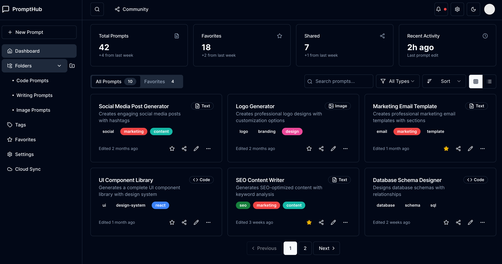
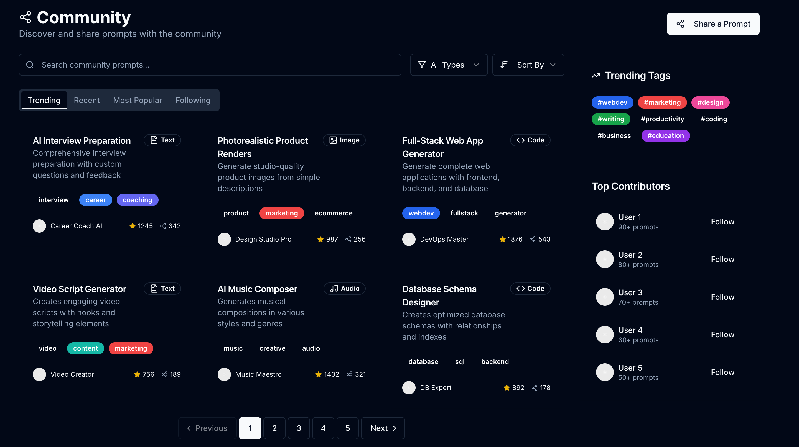
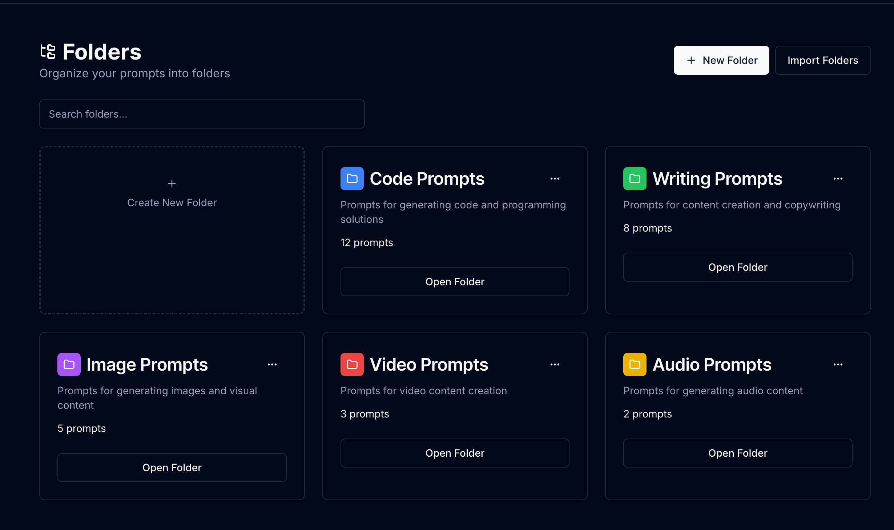

# PromptHub

<p align="center">
  
</p>

<p align="center">
  The ultimate platform for managing and sharing AI prompts
</p>

<p align="center">
  <a href="#features">Features</a> •
  <a href="#screenshots">Screenshots</a> •
  <a href="#installation">Installation</a> •
  <a href="#usage">Usage</a> •
  <a href="#configuration">Configuration</a> •
  <a href="#contributing">Contributing</a> •
  <a href="#license">License</a> •
  <a href="README.zh.md">中文文档</a>
</p>

## Overview

PromptHub is a comprehensive platform designed to help you organize, optimize, and share your AI prompts. Whether you're a developer, content creator, or AI enthusiast, PromptHub provides the tools you need to manage your prompts effectively and collaborate with others.

## Features

### Local-First Security

- **End-to-end encryption**: Keep your prompts secure with strong encryption
- **Automatic local backups**: Never lose your valuable prompts
- **Optional cloud sync**: Choose when and what to sync to the cloud

### Smart Organization

- **Folder-based management**: Organize prompts in intuitive folder structures
- **Tag-based classification**: Add tags to make prompts easily searchable
- **Output type categorization**: Categorize prompts by their output type (text, code, image, etc.)

### Community Sharing

- **Public or private sharing**: Choose which prompts to share with the community
- **Discover trending prompts**: Find popular prompts from other users
- **Follow creators**: Keep up with your favorite prompt creators

### Markdown Editor

- **Real-time preview**: See how your prompt will look as you type
- **Version history**: Track changes to your prompts over time
- **Syntax highlighting**: Better readability for code blocks

### Favorites Collection

- **One-click favorites**: Save prompts you use frequently
- **Organized favorites view**: Keep your favorite prompts easily accessible
- **Quick access**: Get to your most-used prompts faster

### Output Categorization

- **Code, text, image categorization**: Filter prompts by output type
- **Video and audio support**: Support for multimedia prompt outputs
- **Custom output types**: Define your own output categories

## Screenshots

<p align="center">
  
  <br>
  <em>Dashboard View - Manage all your prompts in one place</em>
</p>

<p align="center">
  
  <br>
  <em>Prompt Editor - Create and edit prompts with real-time preview</em>
</p>

<p align="center">
  
  <br>
  <em>Community Sharing - Discover and share prompts with others</em>
</p>

<p align="center">
  
  <br>
  <em>Folder Organization - Keep your prompts neatly organized</em>
</p>

## Installation

### Prerequisites

- Node.js 16.x or higher
- npm 8.x or higher

### Setup

1. Clone the repository:
   ```bash
   git clone https://github.com/yourusername/prompthub.git
   cd prompthub
   ```
2. Install dependencies:
   ```bash
   npm install
   ```
3. Set up environment variables:
   ```bash
   cp .env.example .env.local
   ```
   Edit `.env.local` with your configuration.
4. Run the development server:
   ```bash
   npm run dev
   ```
5. Build for production:
   ```bash
   npm run build
   npm start
   ```

## Usage

### Creating a Prompt

1. Navigate to the dashboard
2. Click "New Prompt" button
3. Enter a title and description
4. Write your prompt content using Markdown
5. Add tags and select an output type
6. Click "Save Prompt"

### Organizing Prompts

- **Folders**: Create folders from the sidebar and drag prompts into them
- **Tags**: Add tags to prompts for cross-folder organization
- **Search**: Use the search bar to find prompts by title, content, or tags

### Sharing Prompts

1. Open a prompt you want to share
2. Click the "Share" button
3. Choose between public or private sharing
4. Copy the generated link or share directly to social media

### Community Features

- Browse trending prompts on the Community page
- Star prompts you find useful
- Follow creators to see their latest prompts
- Filter by output type to find specific kinds of prompts

## Configuration

### User Settings

Access user settings by clicking on your profile picture and selecting "Settings":

- **Profile**: Update your name, bio, and profile picture
- **Account**: Manage your account details and password
- **Appearance**: Customize the app's appearance (light/dark mode)
- **Storage**: Configure local storage and cloud sync options
- **Notifications**: Set up notification preferences

### Workspace Settings

For team accounts, workspace settings can be configured:

- **Members**: Invite and manage team members
- **Permissions**: Set access levels for different members
- **Billing**: Manage subscription and payment details

## API Documentation

PromptHub provides a RESTful API for integrating with other applications:

### Authentication

```
POST /api/auth/token
```

Request body:

```json
{
  "email": "user@example.com",
  "password": "your_password"
}
```

Response:

```json
{
  "token": "your_jwt_token",
  "expiresIn": 3600
}
```

### Prompts

#### Get all prompts

```
GET /api/prompts
```

#### Get a specific prompt

```
GET /api/prompts/:id
```

#### Create a prompt

```
POST /api/prompts
```

Request body:

```json
{
  "title": "My Prompt",
  "content": "This is my prompt content",
  "tags": ["tag1", "tag2"],
  "outputType": "text"
}
```

See the [API documentation](docs/api.md) for more details.

## Contributing

We welcome contributions to PromptHub! Please see our [CONTRIBUTING.md](CONTRIBUTING.md) for details on how to submit pull requests, report bugs, and suggest features.

## License

This project is licensed under the MIT License - see the [LICENSE](LICENSE) file for details.

## Acknowledgements

- [Next.js](https://nextjs.org/) - The React framework used
- [Tailwind CSS](https://tailwindcss.com/) - For styling
- [Vercel](https://vercel.com/) - For deployment
- [All Contributors](../../contributors)

---

<p align="center">
  Made with ❤️ by the PromptHub Team
</p>
