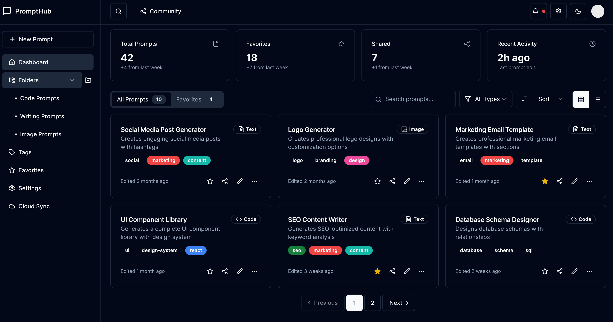
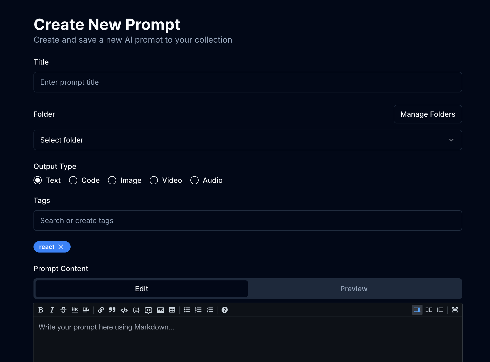

# PromptHub

  

  管理和分享AI提示词的终极平台

  <a href="#功能特点">功能特点</a> •
  <a href="#截图展示">截图展示</a> •
  <a href="#安装">安装</a> •
  <a href="#使用方法">使用方法</a> •
  <a href="#配置">配置</a> •
  <a href="#贡献">贡献</a> •
  <a href="#许可证">许可证</a> •
  <a href="README.md">English</a>

## 概述

PromptHub是一个全面的平台，旨在帮助您组织、优化和分享AI提示词。无论您是开发人员、内容创作者还是AI爱好者，PromptHub都能提供有效管理提示词并与他人协作的工具。

## 功能特点

### 本地优先安全
- **端到端加密**：通过强大的加密保护您的提示词安全
- **自动本地备份**：永不丢失您宝贵的提示词
- **可选云同步**：自由选择何时以及同步哪些内容到云端

### 智能组织
- **基于文件夹的管理**：在直观的文件夹结构中组织提示词
- **基于标签的分类**：添加标签使提示词易于搜索
- **输出类型分类**：按输出类型（文本、代码、图像等）对提示词进行分类

### 社区共享
- **公开或私人共享**：选择哪些提示词与社区共享
- **发现热门提示词**：查找来自其他用户的流行提示词
- **关注创作者**：跟踪您喜爱的提示词创作者

### Markdown编辑器
- **实时预览**：边输入边查看提示词的效果
- **版本历史**：跟踪提示词随时间的变化
- **语法高亮**：提高代码块的可读性

### 收藏集
- **一键收藏**：保存您经常使用的提示词
- **组织收藏视图**：轻松访问您收藏的提示词
- **快速访问**：更快地获取您最常用的提示词

### 输出分类
- **代码、文本、图像分类**：按输出类型筛选提示词
- **视频和音频支持**：支持多媒体提示词输出
- **自定义输出类型**：定义您自己的输出类别

## 截图展示

  
   
  <em>仪表板视图 - 在一处管理所有提示词</em>

  
   
  <em>提示词编辑器 - 创建和编辑提示词，实时预览效果</em>

  
   
  <em>社区共享 - 发现并与他人分享提示词</em>

  
   
  <em>文件夹组织 - 整齐地组织您的提示词</em>

## 安装

### 前提条件
- Node.js 16.x或更高版本
- npm 8.x或更高版本

### 设置

1. 克隆仓库：
\`\`\`bash
git clone https://github.com/yourusername/prompthub.git
cd prompthub
\`\`\`

2. 安装依赖：
\`\`\`bash
npm install
\`\`\`

3. 设置环境变量：
\`\`\`bash
cp .env.example .env.local
\`\`\`
编辑`.env.local`进行配置。

4. 运行开发服务器：
\`\`\`bash
npm run dev
\`\`\`

5. 生产环境构建：
\`\`\`bash
npm run build
npm start
\`\`\`

## 使用方法

### 创建提示词

1. 导航到仪表板
2. 点击"新建提示词"按钮
3. 输入标题和描述
4. 使用Markdown编写提示词内容
5. 添加标签并选择输出类型
6. 点击"保存提示词"

### 组织提示词

- **文件夹**：从侧边栏创建文件夹，并将提示词拖入其中
- **标签**：为提示词添加标签，实现跨文件夹组织
- **搜索**：使用搜索栏通过标题、内容或标签查找提示词

### 分享提示词

1. 打开要分享的提示词
2. 点击"分享"按钮
3. 选择公开或私人分享
4. 复制生成的链接或直接分享到社交媒体

### 社区功能

- 在社区页面浏览热门提示词
- 为您认为有用的提示词点赞
- 关注创作者以查看他们的最新提示词
- 按输出类型筛选以查找特定类型的提示词

## 配置

### 用户设置

通过点击您的个人头像并选择"设置"访问用户设置：

- **个人资料**：更新您的姓名、简介和头像
- **账户**：管理您的账户详情和密码
- **外观**：自定义应用程序的外观（明/暗模式）
- **存储**：配置本地存储和云同步选项
- **通知**：设置通知首选项

### 工作区设置

对于团队账户，可以配置工作区设置：

- **成员**：邀请和管理团队成员
- **权限**：为不同成员设置访问级别
- **账单**：管理订阅和支付详情

## API文档

PromptHub提供RESTful API，可与其他应用程序集成：

### 认证

\`\`\`
POST /api/auth/token
\`\`\`

请求体：
\`\`\`json
{
  "email": "user@example.com",
  "password": "your_password"
}
\`\`\`

响应：
\`\`\`json
{
  "token": "your_jwt_token",
  "expiresIn": 3600
}
\`\`\`

### 提示词

#### 获取所有提示词

\`\`\`
GET /api/prompts
\`\`\`

#### 获取特定提示词

\`\`\`
GET /api/prompts/:id
\`\`\`

#### 创建提示词

\`\`\`
POST /api/prompts
\`\`\`

请求体：
\`\`\`json
{
  "title": "我的提示词",
  "content": "这是我的提示词内容",
  "tags": ["标签1", "标签2"],
  "outputType": "text"
}
\`\`\`

更多详情请参阅[API文档](docs/api.md)。

## 贡献

我们欢迎对PromptHub的贡献！请查看我们的[CONTRIBUTING.md](CONTRIBUTING.md)了解如何提交拉取请求、报告错误和建议功能。

## 许可证

本项目采用MIT许可证 - 详情请参阅[LICENSE](LICENSE)文件。

## 致谢

- [Next.js](https://nextjs.org/) - 使用的React框架
- [Tailwind CSS](https://tailwindcss.com/) - 用于样式设计
- [Vercel](https://vercel.com/) - 用于部署
- [所有贡献者](../../contributors)

---

  由PromptHub团队用❤️制作

